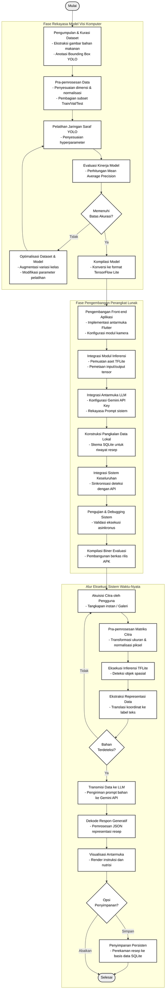

# Diagram Alur Pengembangan Sistem MasakIn

```mermaid
flowchart TD
    %% Styling Definisi
    classDef process fill:#FFFFFF,stroke:#333333,stroke-width:2px,color:#000000;
    classDef decision fill:#FFFFFF,stroke:#333333,stroke-width:2px,color:#000000,shape:diamond;
    classDef terminal fill:#EFEFEF,stroke:#333333,stroke-width:2px,color:#000000,shape:rect,rx:10,ry:10;

    Start([Mulai]):::terminal

    subgraph ML_Phase [Fase Rekayasa Model Visi Komputer]
        DataCollection[Pengumpulan & Kurasi Dataset<br/>- Ekstraksi gambar bahan makanan<br/>- Anotasi Bounding Box YOLO]:::process
        DataPrep[Pra-pemrosesan Data<br/>- Penyesuaian dimensi & normalisasi<br/>- Pembagian subset Train/Val/Test]:::process
        Training[Pelatihan Jaringan Saraf YOLO<br/>- Penyesuaian hyperparameter]:::process
        ModelEval[Evaluasi Kinerja Model<br/>- Perhitungan Mean Average Precision]:::process
        ModelCheck{Memenuhi<br/>Batas Akurasi?}:::decision
        Retrain[Optimalisasi Dataset & Model<br/>- Augmentasi variasi kelas<br/>- Modifikasi parameter pelatihan]:::process
        ExportModel[Kompilasi Model<br/>- Konversi ke format TensorFlow Lite]:::process

        DataCollection --> DataPrep --> Training --> ModelEval --> ModelCheck
        ModelCheck -- Tidak --> Retrain --> Training
        ModelCheck -- Ya --> ExportModel
    end

    subgraph SE_Phase [Fase Pengembangan Perangkat Lunak]
        MobileApp[Pengembangan Front-end Aplikasi<br/>- Implementasi antarmuka Flutter<br/>- Konfigurasi modul kamera]:::process
        TFLiteInteg[Integrasi Modul Inferensi<br/>- Pemuatan aset TFLite<br/>- Pemetaan input/output tensor]:::process
        GeminiInteg[Integrasi Antarmuka LLM<br/>- Konfigurasi Gemini API Key<br/>- Rekayasa Prompt sistem]:::process
        DatabaseSetup[Konstruksi Pangkalan Data Lokal<br/>- Skema SQLite untuk riwayat resep]:::process
        SystemInteg[Integrasi Sistem Keseluruhan<br/>- Sinkronisasi deteksi dengan API]:::process
        QATest[Pengujian & Debugging Sistem<br/>- Validasi eksekusi asinkronus]:::process
        LocalBuild[Kompilasi Biner Evaluasi<br/>- Pembangunan berkas rilis APK]:::process

        MobileApp --> TFLiteInteg --> GeminiInteg --> DatabaseSetup --> SystemInteg --> QATest --> LocalBuild
    end

    subgraph User_Flow [Alur Eksekusi Sistem Waktu-Nyata]
        CaptureImage[Akuisisi Citra oleh Pengguna<br/>- Tangkapan instan / Galeri]:::process
        PreprocessImg[Pra-pemrosesan Matriks Citra<br/>- Transformasi ukuran & normalisasi piksel]:::process
        TFLiteExec[Eksekusi Inferensi TFLite<br/>- Deteksi objek spasial]:::process
        ExtractBox[Ekstraksi Representasi Data<br/>- Translasi koordinat ke label teks]:::process
        ValidCheck{Bahan<br/>Terdeteksi?}:::decision
        GeminiReq[Transmisi Data ke LLM<br/>- Pengiriman prompt bahan ke Gemini API]:::process
        JSONParse[Dekode Respon Generatif<br/>- Pemrosesan JSON representasi resep]:::process
        DisplayResult[Visualisasi Antarmuka<br/>- Render instruksi dan nutrisi]:::process
        UserAction{Opsi<br/>Penyimpanan?}:::decision
        SaveDB[Penyimpanan Persisten<br/>- Perekaman resep ke basis data SQLite]:::process

        CaptureImage --> PreprocessImg --> TFLiteExec --> ExtractBox --> ValidCheck
        ValidCheck -- Tidak --> CaptureImage
        ValidCheck -- Ya --> GeminiReq --> JSONParse --> DisplayResult --> UserAction
        UserAction -- Simpan --> SaveDB --> End([Selesai]):::terminal
        UserAction -- Abaikan --> End
    end

    %% Hubungan antar fase
    Start --> DataCollection
    ExportModel --> MobileApp
    LocalBuild --> CaptureImage
```