# Flowchart Sistem MasakIn

Flowchart di bawah menggambarkan alur sistem aplikasi MasakIn saat ini.

```mermaid
flowchart TD
    Start([Mulai Aplikasi]) --> Splash["Splash Screen<br/>(3 detik)"]
    Splash --> CheckOnboarding{"Onboarding<br/>sudah dilihat?"}
    CheckOnboarding -->|Tidak| Onboarding["Onboarding Screen<br/>(Pengenalan Aplikasi)"]
    CheckOnboarding -->|Ya| MainScreen["Main Screen"]
    Onboarding --> SaveOnboarding["Simpan Status<br/>Onboarding"]
    SaveOnboarding --> MainScreen
    
    MainScreen --> Navigation{"Pilihan<br/>Navigasi"}
    Navigation -->|Tab Home| HomeScreen["Home Screen<br/>(Daftar Resep)"]
    Navigation -->|Tab Saved| SavedScreen["Saved Recipes Screen<br/>(Resep Tersimpan)"]
    Navigation -->|Scan Button| CameraScreen["Camera Detection Screen"]
    
    SavedScreen --> Navigation
    HomeScreen --> ScanButton["Tekan Tombol Scan"]
    ScanButton --> CameraScreen
    
    CameraScreen --> CameraInit["Inisialisasi Kamera"]
    CameraInit --> ImageCapture{"Pilihan<br/>Input"}
    ImageCapture -->|Tangkap Foto| TakePhoto["Ambil Foto<br/>Real-time Camera"]
    ImageCapture -->|Pilih Galeri| PickGallery["Pilih dari<br/>Image Gallery"]
    
    TakePhoto --> PreviewImage["Preview Gambar<br/>dengan Detection Mask"]
    PickGallery --> PreviewImage
    
    PreviewImage --> ProcessDecision{"Lanjutkan<br/>Deteksi?"}
    ProcessDecision -->|Tidak| CameraScreen
    ProcessDecision -->|Ya| Processing["Fase Processing<br/>Dimulai"]
    
    Processing --> LoadModel["Load Model YOLO<br/>(TFLite)"]
    LoadModel --> ImagePreprocess["Preprocessing Gambar<br/>- Letterbox Resize<br/>- Normalisasi"]
    ImagePreprocess --> YOLODetection["YOLO Detection<br/>(Object Detection)"]
    YOLODetection --> ExtractLabels["Extract Labels<br/>& Confidence Score<br/>(threshold: 0.5)"]
    ExtractLabels --> FilterResults["Filter Hasil Deteksi<br/>- Remove Duplicates<br/>- Sort by Confidence"]
    FilterResults --> DetectedIngredients["Daftar Bahan<br/>Terdeteksi"]
    
    DetectedIngredients --> GeminiCall["Request ke Gemini API"]
    GeminiCall --> GeminiProcess["Generative AI<br/>Proses Bahan Makanan"]
    GeminiProcess --> GenerateRecipes["Generate Rekomendasi<br/>Resep (JSON)"]
    GenerateRecipes --> ParseRecipes["Parse JSON Response<br/>- Title<br/>- Description<br/>- Nutrition Info<br/>- Ingredients<br/>- Steps"]
    
    ParseRecipes --> RecipeResultScreen["Recipe Result Screen<br/>(Tampilkan 3 Resep Teratas)"]
    
    RecipeResultScreen --> Navigation2{"User Action"}
    Navigation2 -->|Lihat Detail| RecipeDetail["Recipe Detail Screen"]
    Navigation2 -->|Simpan Resep| SaveRecipe["Simpan ke Database<br/>(SQLite)"]
    Navigation2 -->|Kembali| CameraScreen
    Navigation2 -->|Back to Main| MainScreen
    
    RecipeDetail --> DetailAction{"Aksi di Detail"}
    DetailAction -->|Simpan| SaveRecipe
    DetailAction -->|Kembali| RecipeResultScreen
    
    SaveRecipe --> InsertDB["INSERT ke Table<br/>saved_recipes"]
    InsertDB --> SuccessMsg["Tampilkan Pesan<br/>Berhasil Disimpan"]
    SuccessMsg --> RecipeResultScreen
    
    style Start fill:#90EE90
    style Splash fill:#87CEEB
    style Onboarding fill:#FFB6C1
    style MainScreen fill:#DDA0DD
    style CameraScreen fill:#F0E68C
    style Processing fill:#FFA07A
    style LoadModel fill:#FFB347
    style YOLODetection fill:#FF8C69
    style GeminiCall fill:#98D8C8
    style GenerateRecipes fill:#97C98D
    style RecipeResultScreen fill:#DDA0DD
    style SaveRecipe fill:#87CEEB
    style InsertDB fill:#87CEEB
```



## Penjelasan Alur Sistem

### 1. **Inisialisasi Aplikasi**
- Splash Screen menampilkan logo selama 3 detik
- Memeriksa apakah user sudah menyelesaikan onboarding
- Jika belum, tampilkan Onboarding Screen
- Jika sudah, langsung ke Main Screen

### 2. **Main Screen - Hub Utama**
- Terdiri dari 2 tab navigasi:
  - **Home Screen**: Menampilkan daftar resep
  - **Saved Recipes Screen**: Menampilkan resep yang telah disimpan
- Tombol scan di tengah untuk akses Camera Detection Screen

### 3. **Camera Detection Screen - Akuisisi Gambar**
- Inisialisasi kamera perangkat
- User dapat:
  - Mengambil foto real-time dari kamera
  - Memilih gambar dari galeri
- Preview gambar dengan detection mask overlay
- User memilih untuk lanjut atau ambil foto lagi

### 4. **Processing Phase - Deteksi Bahan**
- **Load Model YOLO**: Memuat model TFLite (`assets/model.tflite`)
- **Preprocessing**: Mempersiapkan gambar (letterbox resize, normalisasi)
- **YOLO Detection**: Melakukan object detection untuk mendeteksi bahan makanan
- **Extract & Filter**: Mengekstrak label dan confidence score, filter berdasarkan threshold (0.5)
- **Result**: Mendapatkan list bahan yang terdeteksi

### 5. **Generative AI Phase - Generate Resep**
- Request ke **Gemini API** dengan list bahan terdeteksi
- Gemini memproses bahan dan generate rekomendasi resep
- Response dalam format JSON terstruktur dengan:
  - Nama resep (title)
  - Deskripsi singkat
  - Waktu memasak
  - Informasi nutrisi (kalori, protein, karbohidrat, lemak)
  - Daftar bahan
  - Langkah-langkah memasak

### 6. **Recipe Result Screen - Menampilkan Hasil**
- Tampilkan bahan yang terdeteksi
- Tampilkan 3 resep teratas dari Gemini
- User dapat:
  - Melihat detail resep
  - Menyimpan resep ke database
  - Kembali ke kamera atau main screen

### 7. **Recipe Detail Screen**
- Tampilkan resep lengkap dengan detil bahan dan langkah
- Opsi untuk menyimpan resep

### 8. **Database - Penyimpanan Resep**
- Menggunakan SQLite (`masakin.db`)
- Tabel `saved_recipes` menyimpan:
  - ID
  - Judul resep
  - Konten (markdown format)
  - Kalori
  - Waktu penyimpanan (timestamp)

## Technology Stack

| Komponen | Teknologi |
|----------|-----------|
| **Framework** | Flutter |
| **AI Detection** | TensorFlow Lite (YOLO Model) |
| **Generative AI** | Google Gemini API |
| **Database** | SQLite |
| **Image Processing** | dart:image package |
| **Camera** | camera plugin |

## Data Flow Diagram

```
Gambar Input
     ↓
YOLO Detection (TFLite)
     ↓
Detected Ingredients
     ↓
Gemini API Request
     ↓
Generated Recipes (JSON)
     ↓
Display to User
     ↓
[Save to Database / View Details / Back to Camera]
```
