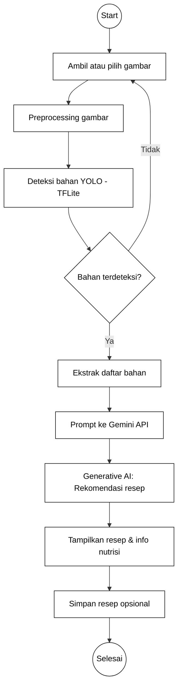

# Flowchart Sistem Ringkas - MasakIn

Diagram berikut menampilkan alur utama aplikasi yang berfokus pada deteksi bahan makanan dan rekomendasi resep.

Ringkasan:
- Ambil gambar → preprocessing → jalankan model YOLO untuk mendeteksi bahan.
- Jika tidak ada bahan, user dapat mengambil ulang gambar.
- Jika ada bahan, ekstrak daftar bahan lalu kirim ke Gemini untuk menghasilkan rekomendasi resep.
- Tampilkan hasil dan beri opsi menyimpan resep.

File ini mengabaikan splash screen dan onboarding, hanya menampilkan fitur utama sesuai permintaan.